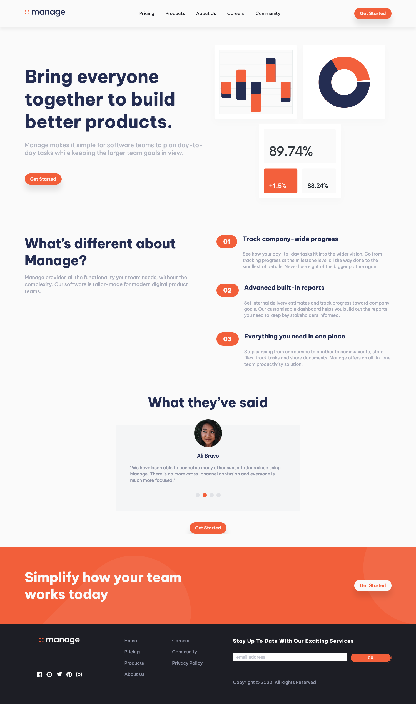
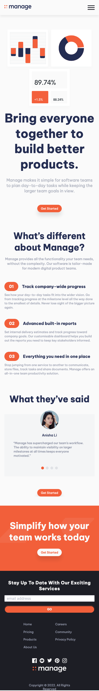

# Frontend Mentor - Manage landing page solution

This is a solution to the [Manage landing page challenge on Frontend Mentor](https://www.frontendmentor.io/challenges/manage-landing-page-SLXqC6P5). Frontend Mentor challenges help you improve your coding skills by building realistic projects. 

## Table of contents

- [Overview](#overview)
  - [The challenge](#the-challenge)
  - [Screenshot](#screenshot)
  - [Links](#links)
- [My process](#my-process)
  - [Built with](#built-with)
  - [What I learned](#what-i-learned)
  - [Why I took this challenge](#why-i-took-this-challenge)
- [Author](#author)

## Overview

### The challenge

Users should be able to:

- View the optimal layout for the site depending on their device's screen size
- See hover states for all interactive elements on the page
- See all testimonials in a horizontal slider
- Receive an error message when the newsletter sign up `form` is submitted if:
  - The `input` field is empty
  - The email address is not formatted correctly
- Revelation animation of main sections on scroll
- Slide testimonials by "Touch", "Mouse" and "Pen" (Pointer events)

### Screenshot

#### Desktop View


#### Mobile View


### Links

- Solution URL: [https://github.com/frankiecflam/manage-landing-page](https://github.com/frankiecflam/manage-landing-page)
- Live Site URL: [Add live site URL here](https://your-live-site-url.com)

## My process

### Built with

- Semantic HTML5 markup
- SASS
- Flexbox
- CSS Grid
- Mobile-first workflow

### What I learned

Thourhgout this project, I managed to use "Grid" to do 2-dimensional layout, and "Flexbox" to do 1-domensional layout. Besides, for the input field in footer, I designed an inline form validation to provide users instant feedback on their input for better UX. In testimonial section, because I wanted to enable users to navigate each testimonial through "Mouse", "Touch" and "Pen", I used Pointer events to create the sliding navigation.

#### Pointer event for sliding through "Touch", "Mouse" and "Pen"
```js
testimonialsItems.forEach((item, i) => {
  item.addEventListener("pointerdown", function (e) {
    startPositionX = e.pageX;

    stopInterval(startSliding);
  });

  item.addEventListener("pointerup", function (e) {
    endPositionX = e.pageX;

    if(endPositionX - startPositionX > slideThreshold) {
      slideTo(determineSlidingTarget(i, "previous"));
    }

    if(startPositionX - endPositionX > slideThreshold) {
      slideTo(determineSlidingTarget(i, "next"));
    }

    startSliding = startInterval(autoSliding, slidingInterval);
  });
});
```

### Why I took this challenge
This is a coding challenge from Frontend mentor. The main purpose of coding this website is to practise my SASS and JS skills.

## Author
- Email - [Frankie Lam](frankiechunfai@gmail.com)
- Instagram - [@frankie___lam](https://www.instagram.com/frankie___lam)
- Facebook - [@Frankie Lam](https://www.facebook.com/frankiecflam)